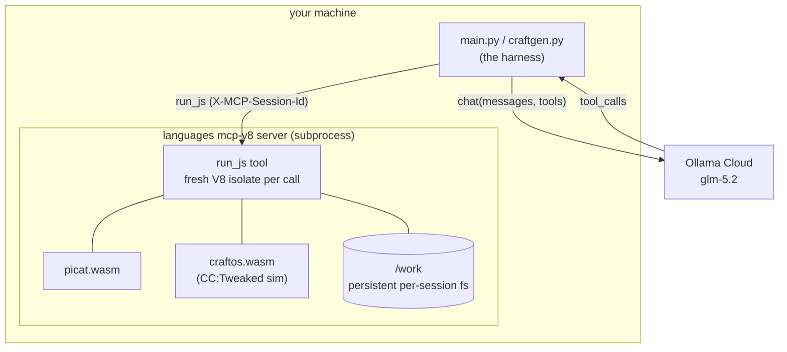
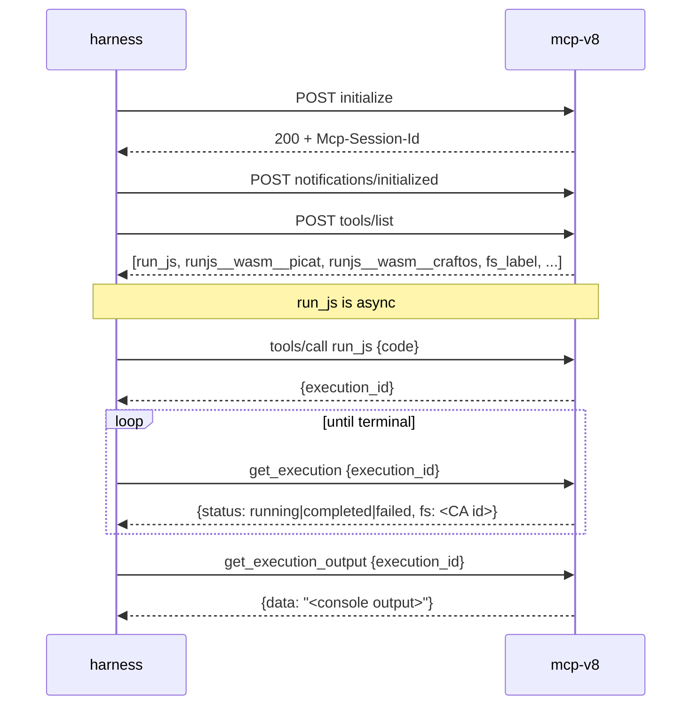
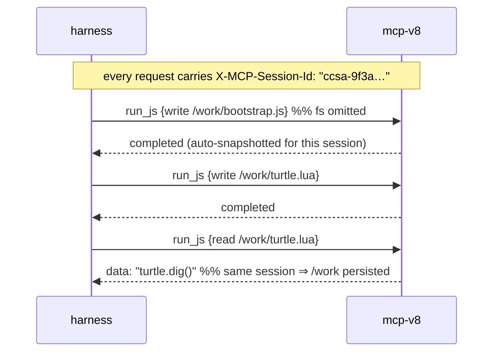
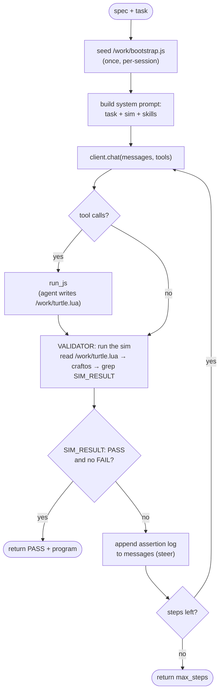
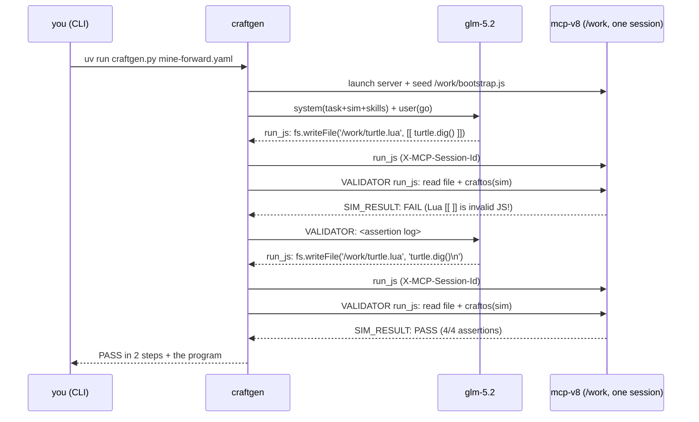

# How ccsa works

Two things live in this repo, sharing one core:

1. **`main.py`** — a naive, generic **multi-MCP mini-swe-agent** driven by Ollama Cloud. Point it at any MCP servers; it unions their tools and loops (model → tool calls → results → repeat).
2. **`craftgen.py`** — a **validator-in-the-loop** program generator. You declare a CraftOS sim with a postcondition; an agent writes a CC:Tweaked (`turtle.lua`) program until a *deterministic* validator proves it passes.

Both run against the bundled **languages MCP server** (`mcp-v8` with the picat + craftos WASM engines), fully sandboxed.

---

## 1. The big picture



The harness is an ordinary Python loop. The LLM never talks to anything directly — the harness relays tool calls to the MCP server and results back to the model.

**Files:**

| file | role |
|---|---|
| `main.py` | mini agent core: MCP client, persistent-`/work` session, agent loop |
| `craftgen.py` | declarative spec + deterministic validator + steering loop |
| `run-languages-mcp.sh` | launches `mcp-v8` with the engines, fully isolated |
| `fetch-mcp-v8.sh` | downloads the prebuilt `mcp-v8` binary |
| `languages/engines/*.wasm` | picat + craftos engines |
| `languages/bootstrap.js` | JS glue that loads the engines into `run_js` |
| `languages/skills/` | CC/turtle/sim reference skills |

---

## 2. The MCP layer (Streamable HTTP)

`mcp-v8` speaks MCP over **Streamable HTTP** at `/mcp`. A session is three POSTs: `initialize` → `notifications/initialized` → then `tools/call`. Responses come back as SSE frames (`data: {...}`), and — importantly — `run_js` is **asynchronous**: it returns an `execution_id` immediately, and you poll `get_execution` / `get_execution_output` for the result.



The harness hides all of this. `mcp_call()` transparently resolves the async handle so the agent just sees output:

```python
# main.py
def mcp_call(http, conn, name, arguments):
    text = _raw_call(http, conn, name, arguments)
    if name not in _ASYNC_TOOLS:
        eid = _maybe_execution_id(text)     # did this return an execution handle?
        if eid is not None:
            return _poll_execution(http, conn, eid)   # poll to completion
    return text
```

---

## 3. Isolation + persistent `/work`

The languages server runs **without `--fs-passthrough`**, so `run_js` cannot touch your real disk. Everything lives in the virtual `/work` filesystem. The rego proves it:

```rego
# run-languages-mcp.sh (generated policy)
package mcp.filesystem
default allow = false
allow if {
    startswith(input.path, "/work")   # /work is ALL the sandbox can touch
    not contains(input.path, "..")
}
```

`/work` is a content-addressed snapshot store under the hood, but mcp-v8 will keep it persistent **per session** for you — *if* you tell it which session. That's the part worth understanding.

### Where "this session's filesystem" comes from

mcp-v8 tools are **self-documenting**: `tools/list` returns a `description` for each tool. The `run_js` description is where all the `/work` behavior is spelled out — quoting it verbatim:

> This server has a **persistent per-session filesystem** … Persist anything you need across calls by writing it to the `/work` filesystem, which is content-addressed and **restored automatically for the same session on the next run**.
>
> `fs` (optional): a filesystem snapshot to mount (a label or a CA id). **Omit to continue this session's filesystem, which is mounted automatically.**
>
> **Session identity comes from the `X-MCP-Session-Id` header during initialization** … so files persist across calls without tracking CA ids.

So "this session's filesystem" = the `/work` tree belonging to the session named by the **`X-MCP-Session-Id`** request header. Omit the `fs` parameter and mcp-v8 mounts that session's latest `/work` automatically and snapshots the result after the call. You never touch CA ids or labels.

### The gotcha: two different "session id" headers

There are **two** headers with nearly the same name, and they are unrelated:

| header | set by | governs |
|---|---|---|
| `Mcp-Session-Id` | the **server** (issued at `initialize`, per the MCP Streamable HTTP spec) | MCP transport session |
| `X-MCP-Session-Id` | **you** (the client) | mcp-v8's persistent `/work` (and heap) |

A standard MCP client only knows `Mcp-Session-Id`. If that's all you send, `/work` is **not** persisted — the first `fs.writeFile('/work/...')` fails with `ENOENT`. Tested:

| you send | `write /work/a.txt` then `read` |
|---|---|
| `Mcp-Session-Id` only | **ENOENT** — `/work` never mounted |
| add `X-MCP-Session-Id: <id>` | `read` → `"persisted!"` ✓ |

This tripped us up hard enough to file it upstream: [mcp-js#200](https://github.com/r33drichards/mcp-js/issues/200) (the confusion) and [#199](https://github.com/r33drichards/mcp-js/issues/199) (the ENOENT symptom).

### What the harness does

Set a **fresh per-run `X-MCP-Session-Id`** on the connection, seed `bootstrap.js` (+ skills) into `/work` once, and from then on just call `run_js` normally (with `fs` omitted). `/work` persists across every call. No labels, no CA-id bookkeeping — the header does it all.

```python
# main.py
@dataclasses.dataclass
class McpConn:
    ...
    work_session: str | None = None          # the X-MCP-Session-Id

    def _headers(self):
        h = {"Content-Type": "application/json",
             "Accept": "application/json, text/event-stream"}
        if self.session_id:  h["Mcp-Session-Id"]   = self.session_id     # transport session
        if self.work_session: h["X-MCP-Session-Id"] = self.work_session   # persistent /work
        return h

def new_work_session():                       # fresh each run → never resolves to a
    return f"ccsa-{uuid.uuid4().hex[:12]}"     # stale head in the shared session store

# open the languages conn bound to a persistent /work, then seed once:
conn = mcp_open(http, spec, work_session=new_work_session())
seed_languages(http, conn, with_skills=True)  # writes /work/bootstrap.js, /work/skills/...
```



> **Why fresh each run?** The session→snapshot mapping lives in mcp-v8's shared session store (`/tmp/mcp-v8-sessions`), which outlives server restarts, while the blobs live in `--fs-dir`. Reusing a fixed id after the blob store changed resolves to a dangling head (`get tree node: No such file`). A per-run id sidesteps that entirely.

*(Earlier revisions of this harness threaded content-addressed snapshot labels by hand — a `WorkFS` class that advanced an `fs_label` after every write. Once we found `/work` is keyed on `X-MCP-Session-Id`, all of that collapsed into "set one header." It's gone.)*

---

## 5. Running an engine

A `run_js` call must load the bootstrap **and** call an engine in the *same* isolate (each call is fresh — nothing survives except `/work`):

```js
// one run_js call
(0,eval)(await fs.readFile('/work/bootstrap.js','utf8'));   // defines picat(), craftos()
const out = await craftos({
  nodes: [
    { label: 'c1', collect: true,
      world_lua: "return { start={x=0,y=64,z=0,facing='south',fuel=100} }",
      program: "turtle.dig() emit('done') done()" },
  ],
});
console.log(JSON.stringify(out));   // run_js returns ONLY what you console.log
```

`craftos(spec)` boots CC:Tweaked computers/turtles, runs each node's Lua, and returns what each `emit()`ted. `picat(code)` runs Picat logic/constraint programs.

---

## 6. craftgen — the validator-in-the-loop

This is the interesting part. The blog idea ([Simple Control Flow for Automatically Steering Agents](https://robertwendt)): don't let the agent *declare* success — embed a deterministic check in the loop and only finish when the real environment state passes.

### The declarative spec

You write one YAML file: a CraftOS sim with a `world.test(sim)` **postcondition**, and a `@file:NAME` sigil marking where the agent's program goes.

```yaml
# examples/mine-forward.yaml
task: >-
  Write a turtle program that digs the block in front and returns to start.
sim:
  timeout_ms: 15000
  nodes:
    - label: rover
      collect: true
      program: "@file:turtle.lua"        # <- the agent authors this at /work/turtle.lua
      world_lua: |
        return {
          start = { x=0, y=64, z=0, facing='south', fuel=100 },
          blocks = { ['0,64,1'] = 'minecraft:stone' },
          test = function(sim)                              -- the POSTCONDITION
            sim.assertBlock(0,64,1, nil, 'front block mined')
            sim.assertPos(0,64,0, 'returned to start')
          end
        }
```

The `world.test(sim)` runs *after* the program, tallies `sim.assert*` calls, and emits `SIM_RESULT: PASS` or `SIM_RESULT: FAIL`. That single line is the gate.

### The loop



The validator runs **every turn**, regardless of what the agent claims:

```python
# craftgen.py (condensed)
for n in range(1, max_steps + 1):
    msg = client.chat(model, messages, tools).message
    for tc in msg.tool_calls:
        out = mcp_call(http, conn, tc.name, tc.args)   # agent writes /work/turtle.lua
        messages.append({"role": "tool", "content": out})

    v = validate(http, conn, spec)      # <- DETERMINISTIC: we run the sim ourselves
    if v.complete:                      # SIM_RESULT: PASS and no FAIL
        return RunResult("pass", n, v.sim_output, ...)
    messages.append({"role": "user", "content": f"VALIDATOR:\n{v.feedback}"})   # steer
```

### What the validator actually does

It generates a `run_js` that reads the agent's file(s) from `/work`, substitutes them into the sim, runs `craftos`, and reports each node's output:

```python
# craftgen._validator_js — the code sent to run_js
(0,eval)(await fs.readFile('/work/bootstrap.js','utf8'));
const nodes = <spec nodes, @file programs nulled>;
for (const k of Object.keys(progFiles))
    nodes[k].program = await fs.readFile(progFiles[k], 'utf8');   // read /work/turtle.lua
const out = await craftos({...spec, nodes});
console.log(JSON.stringify(out.nodes.map(n => ({label:n.label, output:n.output}))));
```

Then Python gates on the postcondition:

```python
has_pass = "SIM_RESULT: PASS" in combined
has_fail = "SIM_RESULT: FAIL" in combined
complete = has_pass and not has_fail
```

### End-to-end, one run



That FAIL→PASS is real: `glm-5.2` first used Lua's `[[ ]]` long-string syntax inside JavaScript (invalid), the deterministic validator caught it, fed back the log, and the model corrected. The agent could never have faked its way past — only the real sim state passes.

---

## 7. Reuse: CLI or webhook

The business logic is `run_taskspec(spec, conn, http, client, ...)` — no argv, no printing, no `sys.exit`. The CLI is a thin wrapper; a webhook handler calls the same function:

```python
# a webhook handler, sketched
spec = load_spec(request.json)          # same declarative spec
with httpx.Client() as http:
    conn = mcp_open(http, languages_server, work_session=new_work_session())  # persistent /work
    seed_languages(http, conn, with_skills=True)
    result = run_taskspec(spec, conn, http, client, model="glm-5.2", max_steps=15)
    return {"status": result.status, "programs": result.programs, "sim": result.sim_output}
```

---

## TL;DR

- **mini agent** = generic loop: `chat → tool_calls → mcp results → repeat`.
- **languages server** = `mcp-v8` + picat/craftos WASM, fully isolated (`/work` only, no host disk).
- **persistent `/work`** = one line: send a fresh per-run `X-MCP-Session-Id` header and omit `fs`; mcp-v8 keeps `/work` for that session. (The header is *not* the MCP-standard `Mcp-Session-Id` — that mismatch is the whole subtlety.)
- **craftgen** = validator-in-the-loop: a declarative sim postcondition is run *deterministically* every turn; the agent iterates until `SIM_RESULT: PASS`. It can't fake completion — the real world state is the judge.
