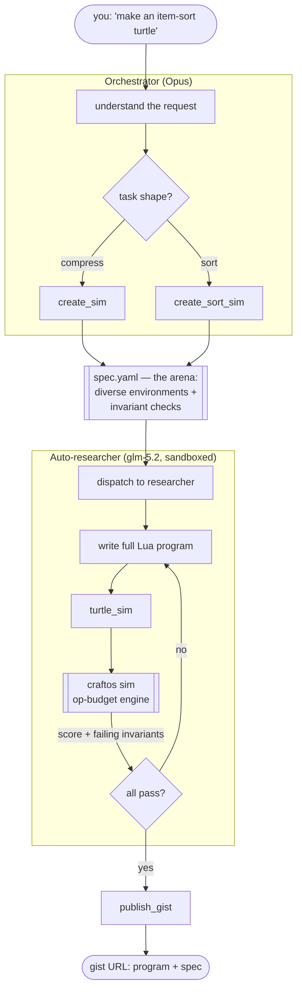

# pi-turtle — how it works

An AI tool that **writes working, robust CC:Tweaked turtle programs for you.** You
describe a turtle in plain English; the system builds a test *arena*, has an agent
iterate a program until it survives the whole arena, then publishes it.

The key idea: **the intelligence goes into the arena, not a hand-written answer.**
`create_sim` doesn't encode "the result is `floor(N/9)`" — it generates *many
diverse environments* checked with *invariants*, so only a genuinely robust turtle
passes. The auto-researcher writes the turtle; the arena is what it must survive.

---

## The pipeline



**Two models, two jobs** (what you asked for):

| role | model | tools | job |
|---|---|---|---|
| **Orchestrator** | Opus | `create_sim`, `create_sort_sim`, dispatch, `publish_gist` | understand the request, build the right arena, delegate, publish |
| **Auto-researcher** | glm-5.2 | `turtle_sim` only | grind: write a program, read failing invariants, fix, repeat until it passes |

Neither can `bash`/`edit`/`write` — they can't shell out or drop files on disk;
they only act *through the sim*. (An earlier version wrote `itemsort.lua` straight
to disk instead of validating — that's now impossible.)

---

## The arena = diverse environments + invariants

Instead of one hand-picked case with the answer baked in, `create_sim` emits a
**battery of environments** and checks **invariants** that hold for *any* correct
turtle:

```lua
-- one environment's post-condition (compression turtle)
sim.assertEq(out * P + left + heldIn, N, 'conservation: nothing lost or duplicated')
sim.assertTrue(left < P,                 'maximality: no full batch left uncrafted')
sim.assertEq(held, 0,                    'terminal: inventory emptied')
sim.assertEq(others(outChest, product), 0, 'purity: output holds only the product')
```

Environments span the edges: **empty input, sub-batch amounts, exact multiples,
large amounts with awkward remainders, and input scattered across many small
stacks.** Passing all of them is what makes the turtle *robust* — not lucky on one
case. (Validated: a correct compressor scores 40/40; a naive one 33/40.)

---

## The tools

### `create_sim` / `create_sort_sim` — build the arena (deterministic)

The model supplies structured params; **our code emits the Lua**, so the arena is
always valid. Two task shapes today:

- **compression:** input → `turtle.craft()` → output
- **in-place sorting:** consolidate + name-sort each adjacent chest, without moving
  items between chests

### `turtle_sim(program)` — the researcher's whole world

```ts
// runs the submitted Lua against every environment, returns score + failures
pi.registerTool({
  name: "turtle_sim",
  parameters: Type.Object({ program: Type.String() }),
  async execute(_id, { program }) {
    writeFileSync(join(SIM_DIR, "prog.lua"), program);
    const r = await runSim();                       // -> craftos sim
    return { content: [{ type: "text",
      text: `score: ${r.score}/${r.total}\n` +
            r.failures.map(f => "  " + f).join("\n") }] };
  },
});
```

### `publish_gist` — share the result

Uploads the passing `prog.lua` + `spec.yaml` to a GitHub gist via `gh`, returns the
URL.

---

## Why it can't hang

A buggy turtle often loops forever, and **no host-side timeout can preempt a
non-yielding loop inside the sim's wasm** (filed upstream:
`r33drichards/mcp-js#202`). The fix lives in the engine we own — an **op-budget**:
every `turtle.*` call ticks a counter that errors over budget.

```lua
-- craftos-engine.lua: any real turtle loop calls turtle.* each iteration,
-- so a non-terminating program aborts in ~seconds instead of hanging.
turtle[name] = function(...)
  ops = ops + 1
  if ops > OP_BUDGET then error("op budget exceeded — likely an infinite loop", 0) end
  return fn(...)
end
```

A buggy program now scores low in ~18s instead of hanging the whole run.

---

## The sorter the researcher discovered (headless, glm-5.2)

Given only `turtle_sim`, glm-5.2 read the `turtle-sorter` skill and produced this —
passing all 39 invariant checks on the first try:

```lua
local function sortChest(d)
  while d.suck() do end                      -- drain chest; inventory merges to minimal stacks
  local names, seen = {}, {}
  for s = 1, 16 do
    local it = turtle.getItemDetail(s)
    if it and not seen[it.name] then seen[it.name] = true; names[#names+1] = it.name end
  end
  table.sort(names)
  for _, name in ipairs(names) do            -- drop back grouped + ordered → consolidated + sorted
    for s = 1, 16 do
      local it = turtle.getItemDetail(s)
      if it and it.name == name then
        turtle.select(s)
        while turtle.getItemCount(s) > 0 do if not d.drop() then break end end
      end
    end
  end
end
```

---

## Status

| capability | state |
|---|---|
| compression turtle (any item/ratio) | ✅ glm hit 5/5, verified |
| in-place sorter (adjacent chests) | ✅ glm hit 39/39 headless, verified |
| invariant arenas + op-budget (no hangs) | ✅ |
| sandboxed agents (no shell-out) | ✅ `--exclude-tools bash,edit,write` |
| Opus orchestrator + glm researcher | ⏳ needs Anthropic auth to run Opus |

## Run it

```bash
MCP_V8_PORT=8790 MCP_V8_SESSION_DB_PATH=/tmp/mcp-v8-pi ./run-languages-mcp.sh &   # sim server
./pi-turtle/pilot.sh          # orchestrator
# then: "Create an item-sort turtle that sorts all adjacent chests in place."
```
